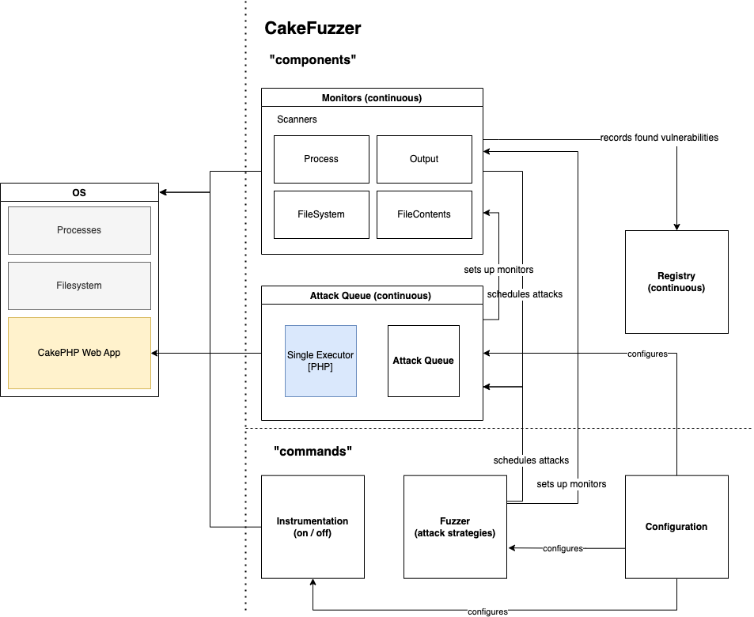

CakeFuzzer
===============

**Latest release**: 1.0<br>
**License**: GNU GPL v3.0<br>

Cake Fuzzer is a project that is meant to help automatically and continuously discover vulnerabilities in web applications created based on specific frameworks with very limited false positives. Currently it is implemented to support the Cake PHP framework.

If you would like to learn more about the research process check out this article series: [CakePHP Application Cybersecurity Research](https://zigrin.com/cakephp-application-cybersecurity-research-white-box-penetration-testing-in-action/)

# Project goals
Typical approaches to discovering vulnerabilities using automated tools in web applications are:
- Static Application Security Testing (SAST) – Method that involves a scanner detecting vulnerabilities based on the source code without running the application
- Dynamic Application Security Testing (DAST) – Method that incorporates a vulnerability scanner that attacks the running application and identifies the vulnerabilities based on the application responses

Both methods have disadvantages. SAST results in a high percentage of false positives – findings that are either not vulnerabilities or not exploitable vulnerabilities. DAST results in fewer false positives but discovers fewer vulnerabilities due to the limited information. It also requires some knowledge about the application and a security background of a person who runs a scan. This often comes with a custom scan configuration per application to work properly.

The Cake Fuzzer project is meant to combine the advantages of both approaches and eliminate the above-mentioned disadvantages. This approach is called Interactive Application Security Testing (IAST).

The goals of the project are:

- Create an automated process of discovering vulnerabilities in applications based on the CakePHP Framework
- No application knowledge requirement or pre-configuration of the web application
- Result with minimal or close to 0 amount of false positives
- Require minimal security knowledge to run the scanner

Note: Some classes of vulnerabilities are not the target of the Cake Fuzzer, therefore Cake Fuzzer will not be able to detect them. Examples of those classes are business logic vulnerabilities and access control issues.

# Architecture
## Overview


Drawio: [Cake Fuzzer Architecture](docs/arch.drawio)

Cake Fuzzer consists of 3 main (fairly independent) servers that in total allow for dynamic vulnerability testing of CakePHP allications.
- AttackQueue - Scheduling and execution of attack scenarios.
- Monitors - Monitoring of given entities (executor outputs / file contents / processes / errors ).
- Registry - Storage and classification of found vulnerabilities.
They run independently. AttackQueue can add new scanners to monitors, and Monitors can schedule new attacks (eg based on found vulnerability to further attack application).

Other components include:
- Fuzzer - defines and schedules attacks to AttackQueue (serves as entry)
- Configuration - sets up application dependent info (eg. path to CakePHP application)
- Instrumentation - based on configuration defines changes to the application / os to prepare the ground for attacks.

## Approach

Cake Fuzzer is based on the concept of Interactive Application Security Testing (IAST). It contains a predefined set of attacks that are randomly modified before the execution. Cake Fuzzer has the knowledge of the application internals thanks to the Cake PHP framework therefore the attacks will be launched on all possible entry points of the application.

During the attack, the Cake Fuzzer monitors various aspects of the application and the underlying system such as:
- network connection,
- file system,
- application response,
- error logs.

These sources of information allow Cake Fuzzer to identify more vulnerabilities and report them with higher certainty.

# Requirements
- CakePHP Web Application installed, configured, and running. Example CakePHP web applications: MISP (https://github.com/MISP/MISP), Cerebrate (https://github.com/cerebrate-project/cerebrate)
- PHP CLI

## Development environment using MISP on VMWare virtual machine
The following section describes steps to setup a Cake Fuzzer development environment where the target is outdated MISP v2.4.146 that is vulnerable to CVE-2021-41326.

### Requirements
- VMWare Workstation (Other virtualization platform can be used as long as they support sharing/mounting directories between host and guest OS)

### Steps
Run the following commands on your host operating system to download an outdated MISP VM:
```bash
cd ~/Downloads # Or wherever you want to store the MISP VM
wget https://vm.misp-project.org/MISP_v2.4.146@0c25b72/MISP_v2.4.146@0c25b72-VMware.zip -O MISP.zip
unzip MISP.zip
rm MISP.zip
mv VMware/ MISP-2.4.146
```

Conduct the following actions in VMWare GUI to prepare sharing Cake Fuzzer files between your host OS and MISP:
1. Open virtual machine in VMWare and go to > Settings > Options > Shared Folders > Add.
2. Mount directory where you keep Cake Fuzzer on your host OS and name it cake_fuzzer on the VM.
3. Start the VM.
4. Note the IP address displayed in the VMWare window after MISP fully boots up.

Run the following commands on your host OS (replace `MISP_IP_ADDRESS` with previously noted IP address):
```bash
ssh-copy-id misp@MISP_IP_ADDRESS
ssh misp@MISP_IP_ADDRESS
```

Once you SSH into the MISP run the following commands (in MISP terminal) to finish setup of sharing Cake Fuzzer files between host OS and MISP:
```bash
sudo apt update
sudo apt-get -y install open-vm-tools open-vm-tools-desktop
sudo apt-get -y install build-essential module-assistant linux-headers-virtual linux-image-virtual && sudo dpkg-reconfigure open-vm-tools
sudo mkdir /cake_fuzzer # Note: This path is fixed as it's hardcoded in the instrumentation (one of the patches)
sudo vmhgfs-fuse .host:/cake_fuzzer /cake_fuzzer -o allow_other -o uid=1000
ls -l /cake_fuzzer # If everything went fine you should see content of the Cake Fuzzer directory from your host OS. Any changes on your host OS will be reflected inside the VM and vice-versa.
```

Prepare MISP for simple testing (in MISP terminal):
```bash
CAKE=/var/www/MISP/app/Console/cake
SUDO='sudo -H -u www-data'
$CAKE userInit -q
$SUDO $CAKE Admin setSetting "Security.password_policy_length" 1
$SUDO $CAKE Admin setSetting "Security.password_policy_complexity" '/.*/'
$SUDO $CAKE Password admin@admin.test admin --override_password_change
```

Finally instal Cake Fuzzer dependencies and prepare the venv (in MISP terminal):
```bash
source /cake_fuzzer/precheck.sh
```


## Contribution to Vulnerability Database
Cake Fuzzer scans for vulnerabilities that inside of `/cake_fuzzer/strategies` folder. 

To add a new attack we need to add a new `new-attack.json` file to `strategies` folder.
Each vulnerability contains 2 major fileds:`Scenarios` and `Scanners`. Scenarios where attack payloads base forms stored. Scanners in the other hand detecting regex or pharases for response, stout, sterr, logs, and results.

#### Creating payload for `Scenarios`
To create a payload first you need to have the understanding of the vulnerability and how to detect it with as few payloads as possible. 

- While constructing the scenario you should think of as most generic payload as possible. However, the more generic payload, the more chances are that it will produce false-positives.

- It is preferable to us a canary value such as`__cakefuzzer__new-attack_§CAKEFUZZER_PAYLOAD_GUID§__` in your scenarios.
Canary value contains a fixed string (for example: `__cakefuzzer__new-attack_`) and a dynamic identifier that will be changed dynamically by the fuzzer (GUID part `§CAKEFUZZER_PAYLOAD_GUID§`). First canary part is used to ensure that payload is detected by `Scanners`. Second canary part, the GUID is translated to pseudo-random value on every execution of your payload. So whenever your payload will be injected into the a parameter used by the application, the canary will be changed to something like this: `__cakefuzzer__new-attack_8383938__`, where the `8383938` is unique across all other attacks.

#### Detecting and generating `Scanners`
To create a scanner, first you need to understand how may the application behave when the vulnerability is triggered. There are few scanner types that you can use such as response, sterr, logs, files, and processes. Each scanner serves a different purpose. 

For example when you building a scanner for an XSS, you will look for the indication of the vulnerability in the HTML response of the application. You can use `ResultOutputScanner` scanner to look for canary value and payload. In other hand SQL Injection vulnerabilities could be detected via error logs. For that purpose you can use `LogFilesContentsScanner` and `ResultErrorsScanner`. 

- One of the important points of creating a scanner is finding a regular expression or a pharase that does not catch false-positive values. If you want to contribute a new vulnerability, you should ensure that there is no false-positive by using the new vulnerability in scans.
- Last attribute of these `Scanner` regular expressions is generating an efficent regex. Avoid using regex that match all cases `.*` or `.+`. They are very time consuming and drasticly increase the time required to finish the entire scan.

#### Efficiency
As mentioned before efficiency is important part of the vulnerabilities. Both `Scenarios` and `Scanners` should include as few elements as possible. This is because Cake Fuzzer executes every single scenario in all possible detected paths multiple times. On the other hand, all responses, new log entries, etc. are constantly checked by the Scanners. There should be a lot of parameters, paths, and end-points detected and therefore using more payload or `Scanner` affects the efficiency quite a lot.

### Removing Specific Vulnerability
If do not want to scan a specific vulnerability class, remove specified json file from the `strategies` folder, clean the database and run the fuzzer again.

For example if you do not want to scan your applicaiton for SQL Injection vulnerabilities, do the following steps:

First of all remove already prepared attack scenarios. To achive this delete all files inside of the `/cake_fuzzer/databases` folder:
```
rm  /cake_fuzzer/databases/*
```

After that remove the `sqlinj.json` file from the `/cake_fuzzer/strategies`
```
rm /cake_fuzzer/strategies/sqlinj.json
```

Finally re-run the fuzzer and all cake_fuzzer running proccess without any SQL Injection attack executed.


# PoC Usage

## Installation
### Clone respository
```
git clone https://github.com/Zigrin-Security/CakeFuzzer /cake_fuzzer
```
> **Warning**
> Cake Fuzzer won't work properly if it's under different path than `/cake_fuzzer`. Keep in mind that it has to be placed under the root directory of the file system, next `/root`, `/tmp`, and so on.

### Change directory to respository
```bash
cd /cake_fuzzer
```

### Venv
Enter virtual environment if you are not already in:
```bash
source /cake_fuzzer/precheck.sh
```
OR
```bash
source venv/bin/activate
```

## Configuration
```bash
cp config/config.example.ini config/config.ini
```

Configure config/config.ini:
```ini
WEBROOT_DIR="/var/www/html"         # Path to the tested applications `webroot` directory
CONCURRENT_QUEUES=5                            # [Optional] Number of attacks executed concurretnly at once
ONLY_PATHS_WITH_PREFIX="/"                      # [Optional] Fuzzer will generates only attacks for attacks starting with this prefix
EXCLUDE_PATHS=""                                # [Optional] Fuzzer will exlude from scanning all paths that match this regular expression. If it's empty, all paths will be processed
PAYLOAD_GUID_PHRASE="§CAKEFUZZER_PAYLOAD_GUID§" # [Optional] Internal keyword that is substituted right before attack with unique payload id
INSTRUMENTATION_INI="config/instrumentation_cake4.ini" # [Optional] Path to custom instrumentations of the application.
```

## Execution
### Start component processes

> **Warning**
> During the Cake Fuzzer scan, multiple functionalities of your application will be invoked in uncontrolled manner multiple times. This may result issuing connections to external services your application is connected to, and pulling or pushing data from/to it. It is highly recommended to run Cake Fuzzer in isolated controlled environment without access to sensitive external services.

> **Note**
> Cake Fuzzer bypass blackholing, CSRF protections, and authorization. It sends all attacks with privileges of a first user in the database. It is recommended that this user has the highest permissions.


The application consists of several components.

> **Warning**
> All cake_fuzzer commands have to be executed as root.

Before starting the fuzzer make sure your target application is fully instrumented:
```bash
python cake_fuzzer.py instrument check
```

If there are some unapplied changes apply them with:
```bash
python cake_fuzzer.py instrument apply
```

To run cake fuzzer do the following (It's recommended to use at least 3 separate terminal):
```bash
# First Terminal
python cake_fuzzer.py run fuzzer                  # Generates attacks, adds them to the QUEUE and registers new SCANNERS (then exits)
python cake_fuzzer.py run periodic_monitors       # Responsible for monitoring (use CTRL+C to stop & exit at the end of the scan)

# Second terminal
python cake_fuzzer.py run iteration_monitors     # Responsible for monitoring (use CTRL+C to stop & exit at the end of the scan)

# Third terminal
python cake_fuzzer.py run attack_queue            # Starts the ATTACK QUEUE (use CTRL+C to stop & exit at the end of the scan)

# Once all attacks are executed
python cake_fuzzer.py run registry                # Generates `results.json` based on found vulnerabilities
```

Note: There is currently a bug that can change the owner of logs (or any other dynamically changed filies of the target web app).
This may cause errors when normally using the web application or even false-negatives on future Cake Fuzzer executions.
For MISP we recommend running the following after every execution of the fuzzer:
```bash
sudo chown -R www-data:www-data /var/www/MISP/app/tmp/logs/
```

Once your scan finishes revert the instrumentation:
```bash
python cake_fuzzer.py instrument revert
```

## To Run Again
To run cake fuzzer again, do the following:

Delete Applications Logs (as an example to this, MISP logs stored `/var/www/MISP/app/tmp/logs`)
```
rm  /var/www/MISP/app/tmp/logs/*
```

Delete All Files Inside of `/cake_fuzzer/databases` folder
```
rm  /cake_fuzzer/databases/*
```

Delete `cake_fuzzer/results.json`file (Firstly do not forget to save or examine previous scan resulst)
```
rm  /cake_fuzzer/results.json
```

Finally follow previous running proccess again with 3 terminals


# FAQ / Troubleshooting
### Attack Queue seems like doing nothing
Attack queue marks executed attacks in the database as 'executed' so to run whole suite again you need to remove the database and add attacks again.

Make sure to kill monitors and attack queues before removing the database.
```
rm database.db*
python cake_fuzzer.py run fuzzer
python cake_fuzzer.py run attack_queue
```

### Target app does not save logs to log files
This is likely due to the fact that the previous log files were overwritten by root. Cake Fuzzer operates as root so new log files will be created with the root as the owner. Remove them:
```
chmod -R a+w /var/www/MISP/app/tmp/logs/*
```

### No files in /cake_fuzzer dir of a VM after a reboot
If you use VM with sharing cake fuzzer with your host machine, make sure that the host directory is properly attached to the guest VM:
```
sudo vmhgfs-fuse .host:/cake_fuzzer /cake_fuzzer -o allow_other -o uid=1000
```

### Target app crashes after running Cake Fuzzer
Cake Fuzzer has to be located under the root directory of the machine and the base directory name should be `cake_fuzzer` specificaly.
```bash
mv CakeFuzzer/ /cake_fuzzer
```

### "Patch" errors while runing `instrument apply`
Instrumentation proccess is a part of Cake Fuzzer execution flow. When you run `instrument apply` followed by `instrument check`, both of these commands should result in the same number of changes.


If you get any "patch" error you could apply patches manually and delete problematic patch file. Patches are located under the `/cake_fuzzer/cakefuzzer/instrumentation/pathces` directory.


### Dependency errors
While installing or running if you have python dependency error, manuallay install dependencies after switching to virtual environment.

First switch to the virtual environment
```bash
source venv/bin/activate
```

After that you can install dependecies with pip3.
```bash
pip3 install -r requriments.txt
```

# Credits

## Inspiration
This project was inspired by:
- Automatic Detection of Vulnerabilities in Web Applications using Fuzzing by Miguel Filipe Beatriz – https://fenix.tecnico.ulisboa.pt/downloadFile/563345090413029/ExtendedAbstract-MEICA-67039-MiguelBeatriz.pdf
- WPGarlic by Krzysztof Zając – https://github.com/kazet/wpgarlic

## Commision
This project was commissioned by:


## Initial contributors
- [Dawid Czarnecki](https://github.com/dawid-czarnecki/) (original author)
- [Adam Bobowski](https://github.com/Bobowski) (lead developer)
- [@Kattorne](https://github.com/Kattorne)
- [Ulaş Deniz İlhan](https://github.com/denizilhan)